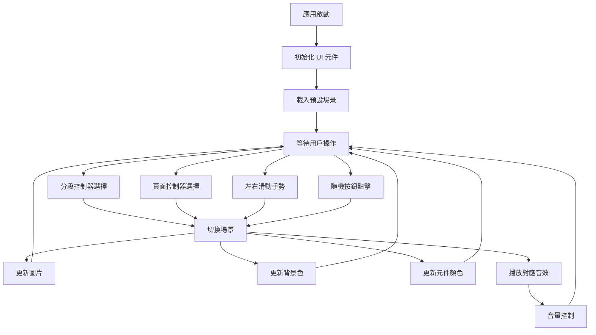
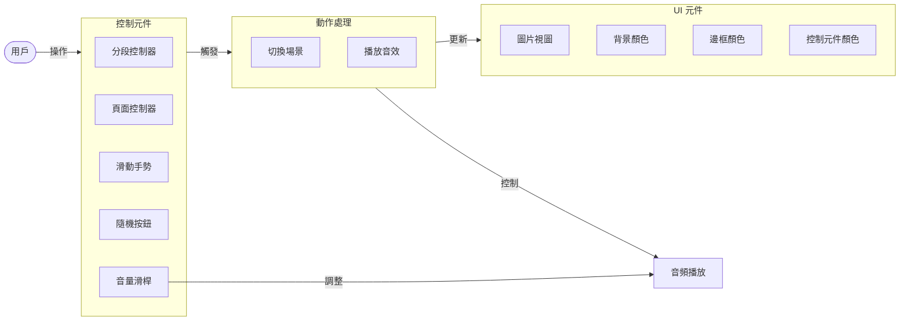
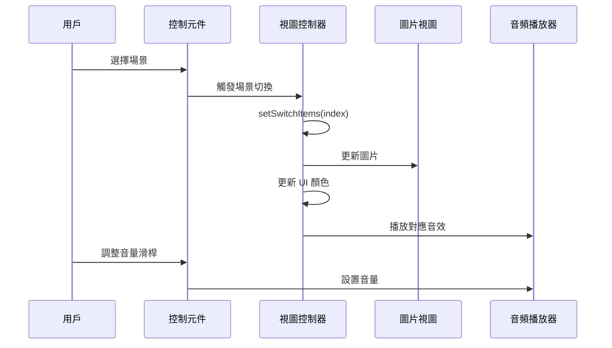

# 多媒體互動應用練習

這是一個 iOS 應用程式，用於練習各種 UI 元件的互動與整合，包括圖片切換、音樂播放、手勢識別等功能。

## 功能概述

本應用程式展示了以下功能：

1. **場景切換**：提供三種不同的場景（碧海輕吟、林間鳥鳴、雨滴呢喃）供用戶選擇
2. **多種控制方式**：
   - 分段控制器 (Segmented Control)
   - 頁面控制器 (Page Control)
   - 左右滑動手勢 (Swipe Gestures)
   - 隨機選擇按鈕
3. **視覺效果**：
   - 圓角圖片框
   - 場景切換時的背景顏色漸變
   - 元件顏色隨場景變化
4. **音效控制**：
   - 場景切換時播放對應的背景音樂
   - 音量滑桿控制

## 技術實現

本應用程式使用了以下 iOS 開發技術：

- UIKit 框架
- AVFoundation 音頻處理
- 動畫效果 (UIView.animate)
- 手勢識別 (UIGestureRecognizer)
- 自定義 UI 元件樣式

## 應用流程

## 元件互動關係

## 場景數據流

## 使用說明

1. 啟動應用程式
2. 透過以下方式切換場景：
   - 點擊頂部的分段控制器選擇場景
   - 使用頁面控制器點選切換
   - 在圖片上左右滑動
   - 點擊「幫我選」按鈕隨機選擇
3. 使用底部的滑桿調整背景音樂音量

## 開發環境

- Xcode 15+
- Swift 5.9+
- iOS 17+

## 專案結構

- **ViewController.swift**: 主要視圖控制器，包含所有互動邏輯
- **Main.storyboard**: UI 佈局
- **Assets.xcassets**: 圖片資源
- **audios/**: 音效文件
